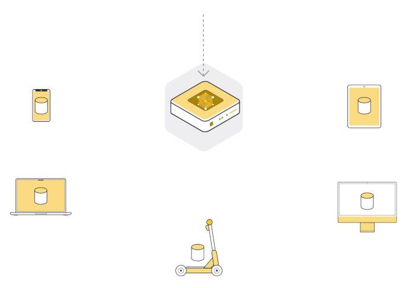
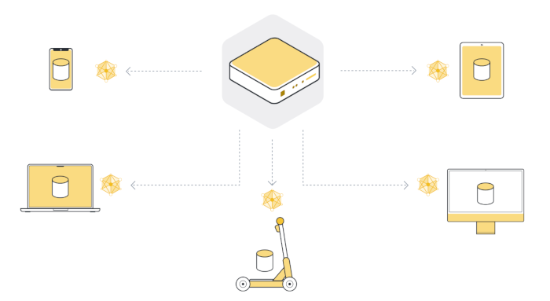
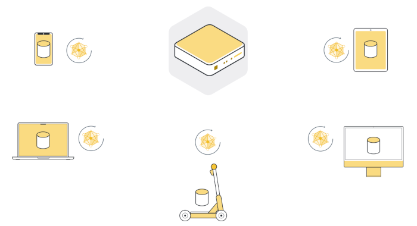
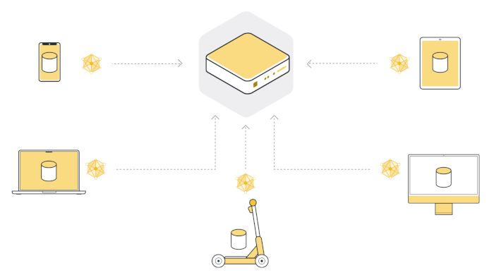
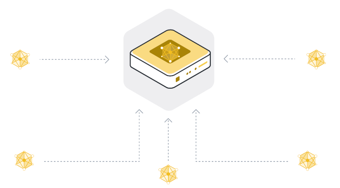

# Federated Learning with Flower and Tensorflow

Flower Framework, which is Federated Learning to be used as Distributed Collaborative Learing Framework

```
연구개발과제명: 일상생활 공간에서 자율행동체의 복합작업 성공률 향상을 위한 자율행동체 엣지 AI SW 기술 개발

세부 개발 카테고리
● 지속적 지능 고도화를 위한 자율적 흐름제어 학습 프레임워크 기술 분석 및 설계
- 기밀성 데이터 활용 지능 고도화를 위한 엣지와 클라우드 분산 협업 학습 프레임워크 기술
- 엣지와 클라우드 협력 학습 간 최적 자원 활용 및 지속적 지능 배포를 위한 자율적 학습흐름제어 기술

개발 내용 
- 엣지와 클라우드 분산 협업을 위한 지속적 지능 배포 프레임워크 
- 자율행동체 엣지 기반 클러스터링 솔루션 및 분산 학습 프레임워크 개발
```

로봇 연합학습 시스템 구현을 위한 [Flower](https://flower.ai/) 프레임워크 활용 프로젝트입니다.

## Overview

- **[Flower](https://flower.ai/)** 프레임워크를 활용한 로봇 연합학습 시스템 구현
- 프레임워크를 활용한 서버와 클라이언트 구현
- 클라이언트는 Tensorflow를 활용한 모델 학습 및 평가 수행
- 서버는 클라이언트로부터 모델 가중치 업데이트를 수신하고, 모델을 집계하여 전체 모델 가중치 업데이트 수행

## Federated Learning Flow

### 1. 글로벌 모델 초기화

- 서버 시작 전 글로벌 모델 초기화
- 기존 학습된 모델 checkpoint 로드
- [Flower Framework](https://flower.ai/docs/framework/tutorial-series-what-is-federated-learning.html) 가이드 참조

{ width=400px}

### 2. 클라이언트에 기본모델 전달

- 서버와 연결된 클라이언트에 학습을 위한 글로벌 모델 전달

{ width=400px}

### 3. 클라이언트 데이터셋을 사용한 로컬 학습

- 서버로 부터 전달받은 최신 모델을 사용하여 로컬 학습 진행

{ width=400px}

### 4. 서버에 클라이언트 모델 데이터 전달

- 클라이언트에서 학습한 모델 데이터를 서버로 전달

{ width=400px}

### 5. 모델 업데이트

- 로컬에서 학습된 모델 데이터를 바탕으로 글로벌 모델 업데이트

{ width=400px}

### 6. 라운드 반복

- 정해진 계획에 맞춰 2 ~ 5 단계 라운드 진행

## System Requirements

```bash
# python version >= 3.11

# virtual env setup
# https://github.com/pyenv/pyenv?tab=readme-ov-file#installation

# install pyenv
curl https://pyenv.run | bash

# install dependencies
sudo apt-get install build-essential zlib1g-dev libffi-dev libssl-dev libbz2-dev libreadline-dev libsqlite3-dev liblzma-dev libncurses-dev tk-dev

# python 3.12.7 install
pyenv install 3.12.7

# set local python version 3.12.7
pyenv local 3.12.7

# create virtual environment and activate
python -m venv venv
. ./venv/bin/activate
```

## Installation

```bash
# install requirements
pip install -r requirements.txt
```

## Usage

### Server

```bash
python src/flower_study/server.py
```

### Client

#### Use Online Dataset

```bash
# set server ip and port
export SERVER_IP="10.177.196.xx"
export SERVER_PORT="30xxx"

python src/flower_study/client.py
```

#### Use Custom Dataset

- 로컬에 미리 제작해둔 커스텀 데이터셋 필요

```bash
python src/flower_study/client_custom_dataset.py "1" # 1: Client ID
```

### Prediction

```bash
# Use Online Dataset
python src/flower_study/predict_test.py

# Use Custom Dataset
# 로컬에 미리 제작해둔 커스텀 데이터셋 필요
python src/flower_study/predict_test_custom_dataset.py
```

---

## Related Project

```
https://github.com/Open-Edge-Robotics/A.EdgeAI-fl-perception
To deploy Perception engine,  which is model resulted from Federated Learning 

https://github.com/Open-Edge-Robotics/A.RobotAI-ros2-streamer
To make and send stream of ROS 2 images captured from carmera attached to Robot.

https://github.com/Open-Edge-Robotics/A.EdgeAI-rosbag-reader
Reader function to extract the data (including images) from rosbag of ROS2

https://github.com/Open-Edge-Robotics/A.CloudAI-fl-flower
Flower Framework, which is Federated Learning to be used as Distributed Collaborative Learing Framework

https://github.com/Open-Edge-Robotics/A.CloudAI-kube-multi-ctl
Customized kubectl to manage multiple k8s master node (standalone node)

https://github.com/Open-Edge-Robotics/A.RobotAI-kube-crd  (ebme-crd)
Kubernetes custom resource definition to deploy the specific robot engines and applications
```
